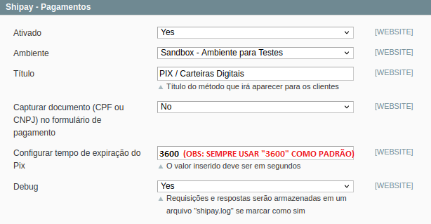
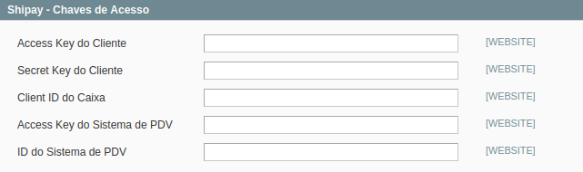
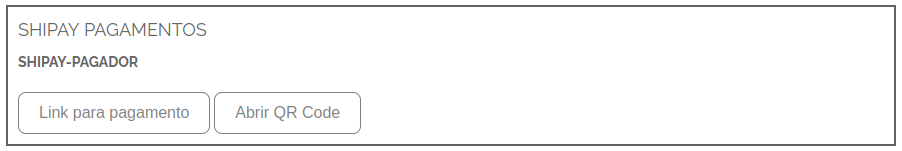
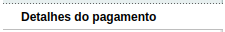
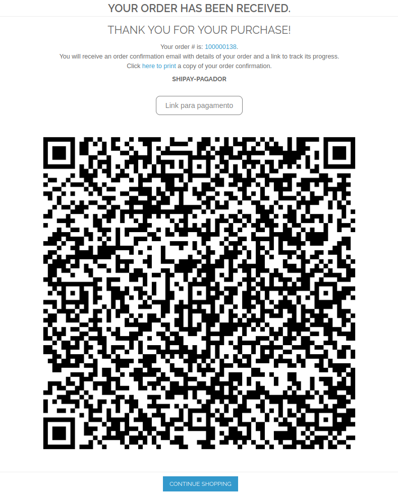
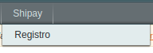

# **[Módulo de Pagamento Shipay - Magento 1.9](README.md)**

### *Instalação*

------

Recomendamos que você tenha um ambiente de teste antes de fazer o upgrade para sua loja em produção, para que seja possível fazer todas as validações necessárias sobre as ações do módulo. Sugerimos também que seja feito um backup da sua loja antes da instalação.

------

### *Compatibilidade*

*Magento 1.9.4.5 & PHP 7.4*

------

### *Instalação do Módulo*

Faça o download do módulo e siga os passos abaixo:

[Shipay-Magento19](https://github.com/tezusecommerce/Shipay_Magento19)

1. Faça o download do módulo.
2. Entre na pasta `Shipay_Magento19` e copie todos os arquivos para a pasta da loja Magento 1.9.
3. Faça uma **mesclagem** dos arquivos do módulo com os da loja.
4. No painel de administração do Magento, acesse `Sistema` -> `Gerenciar Cache` clique em `"Marcar Todos"` e clique em `"Enviar"`.
5. No painel de administração do Magento, acesse `Sistema` -> `Gerenciar Índices` clique em `"Marcar Todos"` e clique em `"Enviar"`.

------

### *Configurações do Módulo*

Acesse o painel administrativo do Magento, clique em `Sistema` -> `Configuração`, na seção `Vendas` clique em `Formas de Pagamento`.

Desça até encontrar `Shipay - Pagamentos`, `Shipay - Chaves de Acesso`.

Então, nesta parte vamos ter 2 etapas de configuração.

#### 1- Shipay - Pagamentos

- **Ativado:** este campo tem a função de habilitar e desabilitar o módulo / método de pagamento. 
- **Ambiente:** neste campo você poderá selecionar entre o ambiente de `sandbox` e `produção`.
  - Sandbox - ambiente de testes.
  - Produção - ambiente de produção.
- **Título:** neste campo você pode editar o título que aparecerá para o cliente no momento do checkout.
- **Capturar documento (CPF ou CNPJ) no formulário de pagamento:** neste campo o cliente pode optar em capturar o documento do cliente no momento do checkout ou não.
  - Sim - cliente terá que preencher seu documento no checkout.
  - Não - cliente não precisará preencher seu documento no checkout.
  - **Observação:** se marcar como **Não**, você deve setar como obrigatório o campo `Exibir CPF/CNPJ`.
    - **Exibir CPF/CNPJ:** `Sistema` -> `Configuração` -> `Clientes` -> `Configurações` -> `Opções de Nome e Endereço` -> `Exibir CPF/CNPJ`. **Obrigatório**.
- **Configurar tempo de expiração do Pix:** neste campo você pode configurar o **tempo de expiração** de um pedido `Pix`. A unidade informada deve ser em **`segundos`**
- **Debug:** campo que possibilita a ativação e a desativação da ferramente debug do módulo:
  - Sim - as requisições e respostas serão armazenadas em um arquivo chamado "shipay.log".
  - Não - as requisições e respostas não serão armazenadas.
- **Base URL:** URL base do site (necessário preencher somente em caso de haver extras na URL Ex: `https://shipay.com.br/(extra1)/(extra2)`).

#### 2- Shipay - Chaves de Acesso

- **Access Key do Cliente:** este campo deve ser preenchido com a **key** que você pode encontrar no painel da *Shipay*. Caso você faça o cadastro na plataforma da *Shipay* pelo painel do Magento essa **key** será preenchida automaticamente.
- **Secret Key do Cliente:** este campo segue a mesma regra do campo "Access Key do Cliente", podendo ser encontrado no painel da *Shipay* ou ele será preenchido automaticamente ao realizar o cadastro pelo painel do Magento.
- **Client ID do Caixa:** este campo segue a mesma regra dos campos acima, com diferencial que no painel da Shipay ele será encontrado na parte dos caixas da sua loja. Também sendo preenchido automaticamente ao realizar o cadastro pelo painel do Magento.
- **Access Key do Sistema de PDV:** este campo será disponibilizado pela equipe Shipay, é necessário preenche-lo para realizar o cadastro na *Shipay* pelo painel do Magento.
- **ID do Sistema de PDV:** segue o mesmo molde do campo "Access Key do Sistema de PDV". É necessário preenche-lo para realizar o cadastro na *Shipay* pelo painel do Magento.

#### Customizações adicionadas:

- No painel do cliente (frontend)

  - Pagamentos:

  

  

- No painel administrativo, ao visualizar um pedido:

  - Adicionado nova secão: "Detalhes do pagamento".

    

  - Conteúdo:

    

    

- Página de sucesso customizada.

  

  

#### Shipay - Registro

Dentro do painel do Magento é possível realizar o cadastro na plataforma da *Shipay*.

Entrando em `Shypay` -> `Registro`:

Ao acessar:

Após o preenchimento o usuário será redirecionado para o painel *Shipay*.

**Observação:** para que o registro seja funcional, deve ser configurado a "Access Key do Sistema de PDV" e "ID do Sistema de PDV", nas configurações do módulo.
